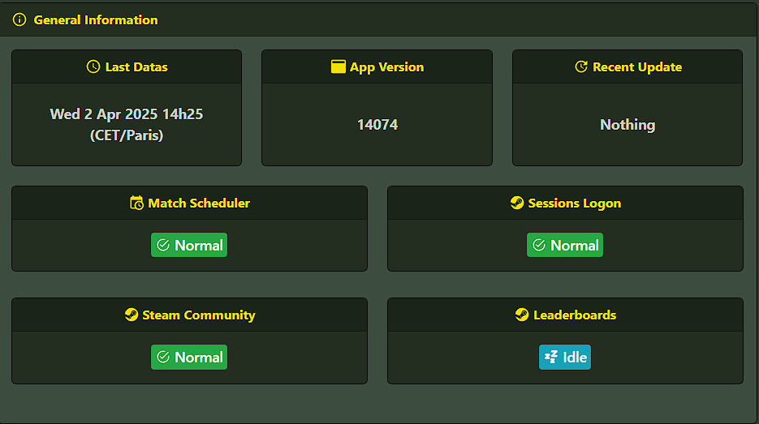
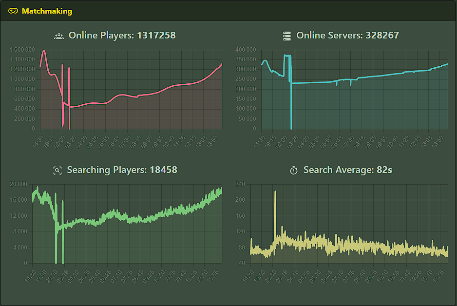
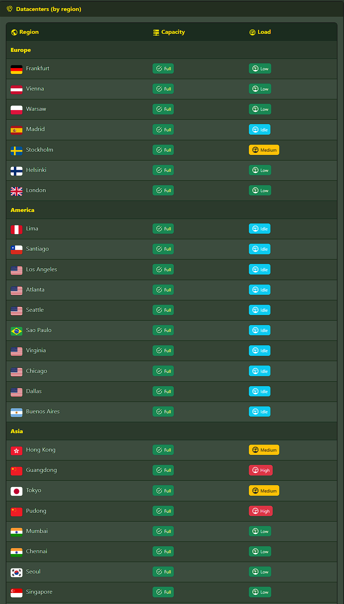

# Steam Status — Counter-Strike 2 Monitor

> 🇫🇷 Vous cherchez la version française ? [Cliquez ici](README.md)

Symfony application to monitor real-time data about Counter-Strike 2: version info, service status, player & server stats, and global server load per region.

---

## 🎮 Features

- Current CS2 version and update detection (within 24h)
- Steam/CS2 service status:
  - Matchmaking
  - Game Sessions
  - Steam Community
  - Leaderboards
- Interactive graphs (last 24h):
  - Online players
  - Online servers
  - Players searching
  - Average matchmaking time
- Region map with server load & capacity

---

## ⚙️ Tech stack

- **Symfony 6.x**
- **PostgreSQL**
- **Twig & Bootstrap**
- **Symfony UX Turbo, Chart.js, Icons**
- **flag-icons**

---

## 🖼️ Preview

### General Informations

### Matchmaking Status

### Datacenter Map

---

## 🚧 Deployment

This project is still in development. Docker deployment coming soon.

---

## 🤝 Contributing

Feel free to contribute!  
Please respect the project rules, and **do not remove or alter the "Credits" card linking to [PxL1337](https://github.com/PxL1337)**.

---

## 📄 License

See [LICENSE](LICENSE)  
> Free to use and modify, except for the "Credits" card linking to the author's GitHub which must remain intact.
