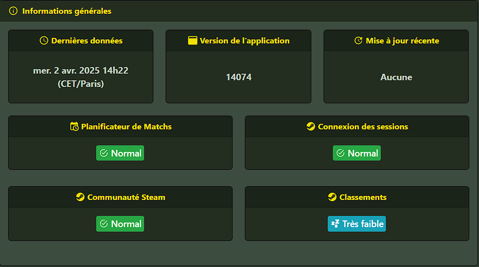
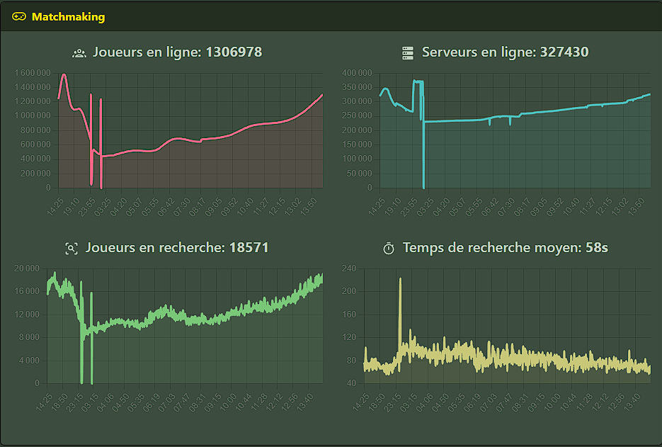
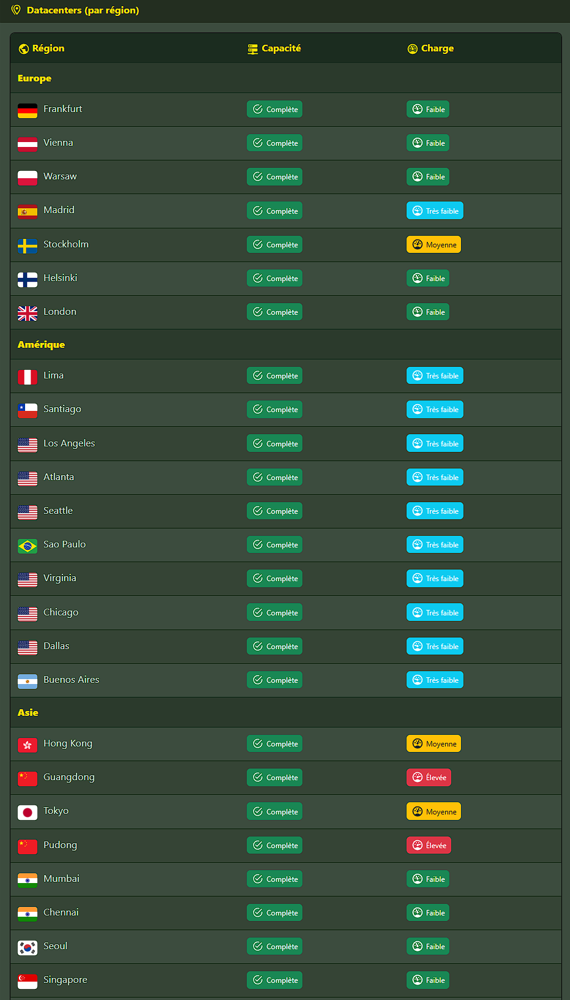

# Steam Status — Counter-Strike 2 Monitor

> 🇬🇧 Looking for the English version? [Click here](README.en.md)

Application Symfony permettant de visualiser en temps réel l’état de Counter-Strike 2 : version, services, joueurs, serveurs et charge réseau mondiale.

---

## 🎮 Fonctionnalités

- Version actuelle de CS2 et détection des mises à jour < 24h
- Statut des services Steam/CS2 :
  - Matchmaking
  - Sessions de jeu
  - Communauté Steam
  - Classements
- Graphiques interactifs sur 24h :
  - Joueurs en ligne
  - Serveurs en ligne
  - Joueurs en matchmaking
  - Temps de recherche moyen
- Liste des régions avec charge et capacité des serveurs

---

## ⚙️ Stack technique

- **PHP 8.3**
- **Symfony 7.x**
- **PostgreSQL**
- **Twig & Bootstrap**
- **Symfony UX Turbo, Chart.js, Icons**
- **flag-icons**

---

## 🖼️ Aperçu

### Informations générales

### État du matchmaking

### Carte des datacenters

---

## 🚧 Déploiement

Projet en cours de développement. Un déploiement Docker est prévu dans une version future.

---

## 🤝 Contribuer

Les contributions sont les bienvenues !  
Merci de respecter les règles du projet, et **ne modifiez pas la carte de crédits visible dans l’application**.

---

## 📄 Licence

Voir [LICENSE](LICENSE)  
> Ce projet est libre d'utilisation, avec une restriction : **la carte de crédits renvoyant vers [PxL1337](https://github.com/PxL1337) ne doit pas être modifiée ni supprimée.**
